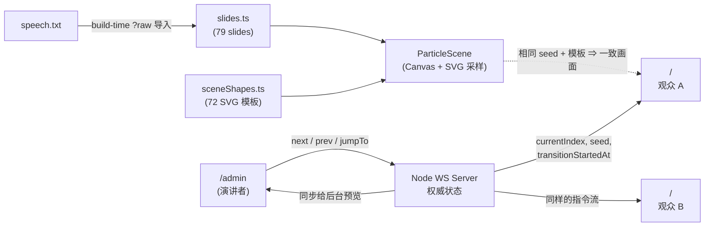

# AI Coding 反直觉的那些事 · 粒子演讲

这是一份"反传统 PPT"的演讲项目：

- [`speech.txt`](speech.txt) — 完整演讲稿《AI Coding 反直觉的那些事》。
- [`prompt.txt`](prompt.txt) — 最初的需求描述（产物即本仓库）。
- [`presentation/`](presentation/) — 基于 React + Vite + WebSocket 的前端演讲页面，按演讲稿每个中文句号 `。` 切分为独立页面，每页用大量粒子拟合 SVG 图示，不拟合任何文字。后台控制端通过 WebSocket 广播翻页"指令流"，所有观众浏览器各自在本地以满帧渲染，画面保持一致。

整套演讲共 **79 张幻灯片**（1 张封面 + 78 个句子），覆盖 **72 套独立 SVG 图示模板**。

## 快速启动

```bash
cd presentation
npm install

# 本地开发：Vite 5173 + WS 5174
npm run dev

# 演讲日：单进程同时托管静态资源和 WebSocket（默认 5174）
npm run build
npm run start
```

- 观众访问 `http://<主机>:5174/`（直接看 / 看本机的 5173 用于开发）。
- 演讲者打开 `http://<主机>:5174/admin` 操控演讲。

## 工作原理



服务器只下发"翻页指令"和随机种子，**不**通过网络传输逐帧像素或粒子坐标。所有观众使用同一 `seed` 在本地以同一套 SVG 模板生成同样的采样点，再依赖每条消息中的 `serverTime` 校准本地与服务器墙钟差，使切换时机近似一致。这样每个浏览器都能跑出最流畅的 60fps，又"像直播一样"看到同步画面。

## 关键特性

- **粒子拟合 SVG 图示**：每页对应一类图示（时间线、流程链、ReAct 循环、注意力矩阵、BERT 网络、状态条、诊断日志…），仅由几何与 SVG 路径组成；粒子根据路径长度比例分布，切页时按种子洗牌重新分配目标，呈现"魔法重组"。
- **观众端**：全屏粒子 Canvas + 底部圆角灰底白字字幕（当前句子）。
- **后台控制端**：
  - 当前页大预览 + 下一页缩略预览。
  - 上一页 / 下一页 / 开始计时 / 重置 按钮。
  - 进度条 + 当前页号 / 已用时间 / 平均每页 / **实时刷新的预估剩余时间**。
  - 演讲稿全文：当前句子 **红色加粗**，前文淡灰，点击任意句子可跳页。
  - 键盘快捷键：`→` `Space` `PageDown` 下一页，`←` `PageUp` 上一页，`Home` 首页，`End` 末页，`S` 开始计时，`R` 重置。
- **断线自动重连**：观众侧 WebSocket 指数退避，掉线期间页面提示"正在重连"。

## 仓库结构

```
ai-coding-share/
├── speech.txt              # 演讲稿原文
├── prompt.txt              # 项目最初的需求
├── README.md               # 本文件
└── presentation/           # 演讲前端 + 同步服务
    ├── README.md           # 子项目详细文档（含启动、目录说明）
    ├── package.json
    ├── server/index.ts     # Node WS + 静态文件服务
    └── src/
        ├── App.tsx
        ├── main.tsx
        ├── styles.css
        ├── slides.ts                       # 演讲稿解析 + 句子→场景映射
        ├── particle/
        │   ├── ParticleScene.tsx           # Canvas 粒子渲染与 morph 动画
        │   └── sceneShapes.ts              # SVG 图示模板 + 路径采样
        ├── sync/wsClient.ts                # WebSocket 同步 hook
        └── pages/
            ├── AudiencePage.tsx
            └── AdminPage.tsx
```

详细的子项目用法见 [`presentation/README.md`](presentation/README.md)。
